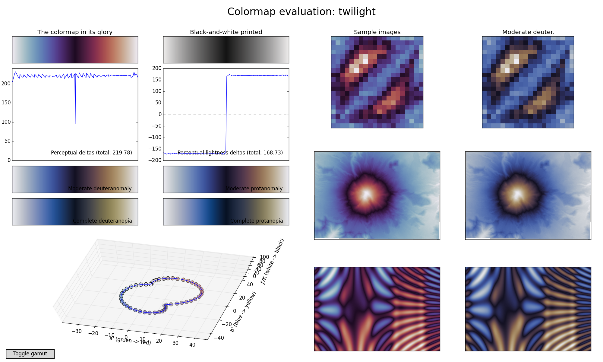

# Twilight -- A Circular Color Map

The colors begin with off-white, ranges through blue to off-black,
then to red and back to off-white. Perceptual lightness contrast and
color contrast are uniform over the whole value range. The colormap
prints as perfect white-black-white, and works equally well with color
blindness.

