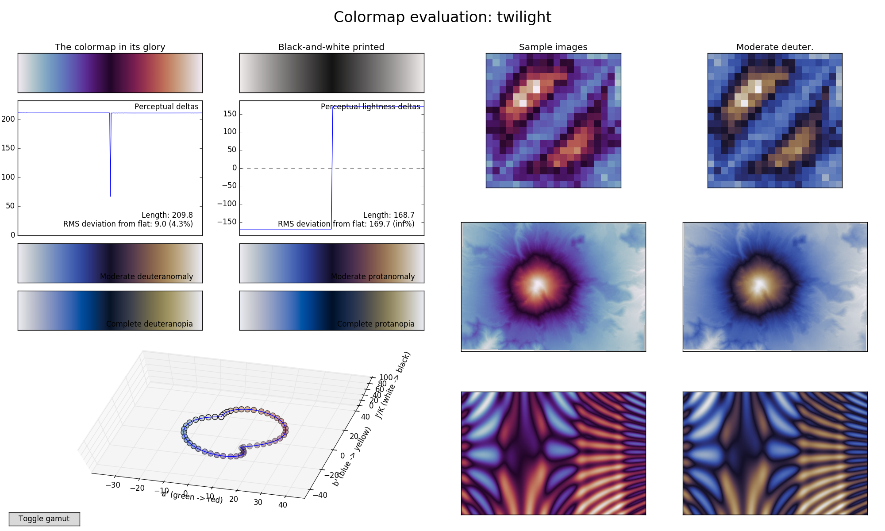

# Twilight -- A Circular Color Map

The colors begin with off-white, ranges through blue to off-black,
then to red and back to off-white. Perceptual lightness contrast and
color contrast are uniform over the whole value range. The colormap
prints as perfect white-black-white, and works equally well with color
blindness.

Note that the small ripple in the perceptual deltas are the result of only using "only" 35 color steps. If you need more color steps, they are defined in [red.py][] and [blue.py][].

The colormap was designed using the [viscm](https://github.com/matplotlib/viscm) colormap design tool by creating a perceptually uniform colormap from off-black to off-white through red, and another colormap from the same off-black to the same off-white through blue. The files [red.py][] and [blue.py][] are still editable through viscm.

[red.py]: https://github.com/bastibe/twilight/blob/master/red.py
[blue.py]: https://github.com/bastibe/twilight/blob/master/blue.py
